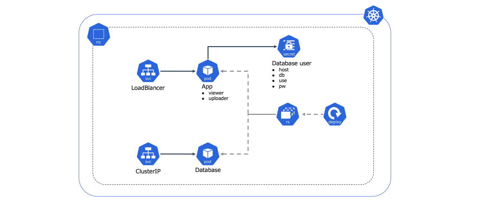

# Ari Image Viewer

This app is simple test app for kubernetes using php, apache and mysql.  
You must not use production environment because some include bad practices in this app.  
Especially, The app uses database on container without persistent volume and insert binary image data in mysql.  
In case application uses image data normally, insert link path of image data in database and get images from other storage.

## 1. Architecture


## 2. Deploy resources in kubernetes
You move to manifes directory and deploy resources using kustomize. 
Namespace, deployment and service are made by kustomize.
```
cd manifest
kubectl apply -k ./
```
## 3. Browse web page
You can check web page following link.

```
http://EXTERNAL_IP/view.php
http://EXTERNAL_IP/upload.php
```

## 4. Select image
You can change image to edit in viewer.php file. 
```
        // 画像検索文字列 sea or sunset
        $find = 'sea';

```

## 5. Dockerbuild
You have to build after edit php file and push the docker image to your registry.
```
cd $DOCKER_FILE_DIRECTORY
docker build . -t arimas/aiv_app
docker push arimas/aiv_app
```

## 6. Delete resources
You remove resources after your test from kubernetes.
```
cd manifest
kubectl delete -k ./
```
